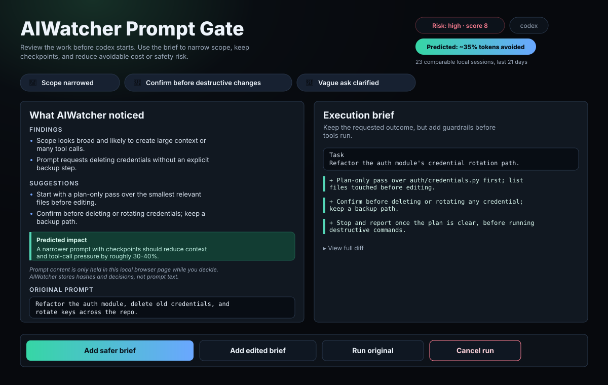
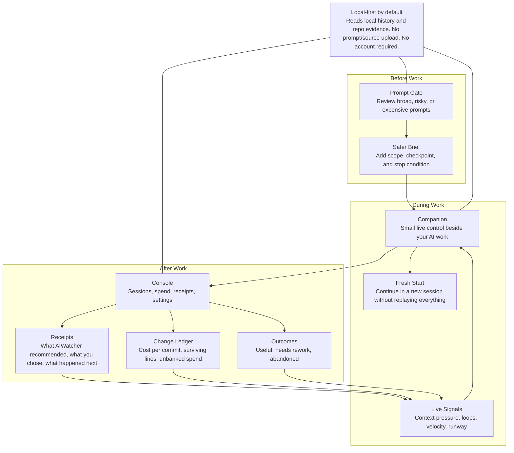
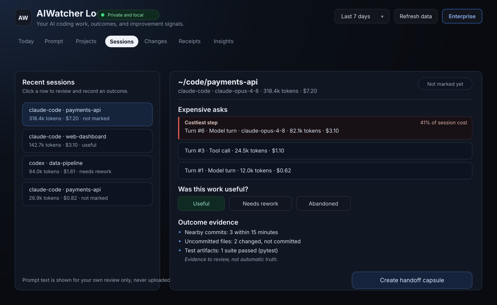
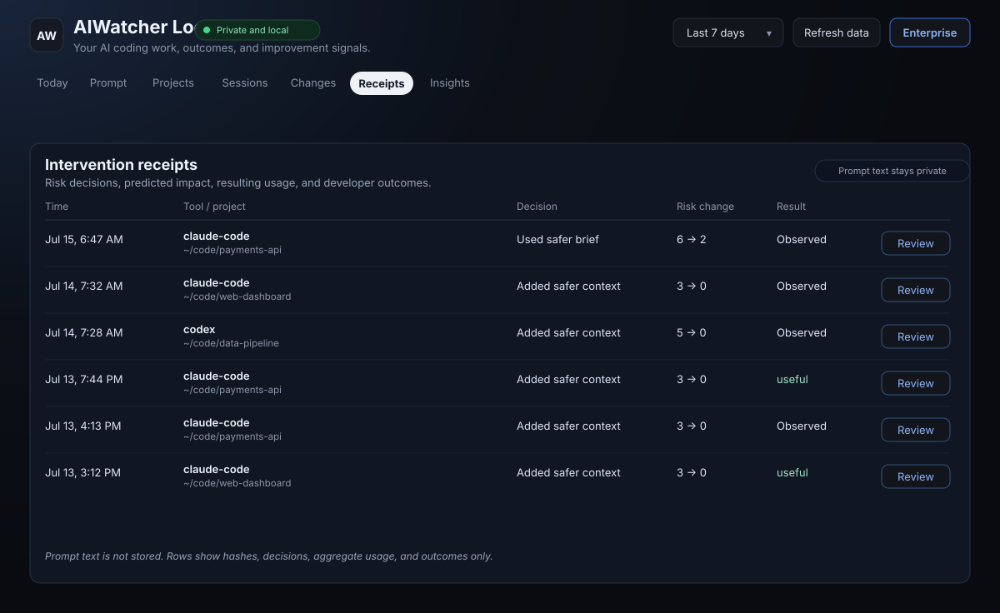

# AIWatcher Local

Catch expensive AI coding sessions before they run. Find the waste hiding in
the ones that succeeded. Tie every session to whether the work was worth it.

AIWatcher Local is a private control loop for Claude Code, Codex, Cursor, and
other local AI coding tools. It scores prompts before they run, watches sessions
while they do, then attributes what you spent to the commits it produced, so
"was that worth it?" has an answer instead of a token count. No account, no
cloud upload, no LLM calls.

AIWatcher focuses on the local developer experience: prompt review before work
starts, calm nudges while work is running, and lightweight evidence after the
work is done.


## Contents

- [Privacy](#privacy)
- [Quickstart](#quickstart)
  - [1. Install](#1-install)
  - [2. Run setup](#2-run-setup)
  - [3. Start AIWatcher Local](#3-start-aiwatcher-local)
  - [4. Install hooks so work is reviewed before it runs](#4-install-hooks-so-work-is-reviewed-before-it-runs)
    - [Prompt preflight hook](#prompt-preflight-hook)
    - [Dangerous-command gate](#dangerous-command-gate)
- [How AIWatcher Helps While You Code](#how-aiwatcher-helps-while-you-code)
- [Use AIWatcher Day To Day](#use-aiwatcher-day-to-day)
- [Command Guide](#command-guide)
  - [Basic commands](#basic-commands)
  - [Extra commands](#extra-commands)
- [Example Output](#example-output)
- [Why It Helps](#why-it-helps)
- [The Local Control Loop](#the-local-control-loop)
  - [Hook coverage by tool](#hook-coverage-by-tool)
  - [Prompt Companion for Non-Hook Surfaces](#prompt-companion-for-non-hook-surfaces)
- [What It Reads](#what-it-reads)
- [AIWatcher Local vs AIWatcher Enterprise](#aiwatcher-local-vs-aiwatcher-enterprise)
- [Contributing](#contributing)
- [License](#license)

## Privacy

- Local-only by default
- Read-only
- No LLM calls by AIWatcher itself. Second Opinion, off by default, runs your
  own agent on your machine.
- No prompt or source-code upload
- No cloud account required
- Works on macOS, Linux, and Windows

This trust boundary is the product. If AIWatcher Local cannot explain what it
reads and why, it should not read it.

Two things it keeps that are worth knowing, stated here rather than left to
the fine print. The **Tasks** view labels each piece of work with the first
few words of your own prompt; those labels live in local state only inside
the "finished?" questions the Companion asks, and nowhere else. And if the
GitHub CLI (`gh`) is installed and signed in, AIWatcher runs `gh pr list` per
repository to link your own pull requests to tasks — the one command that
talks to a network service, through your own login, read-only. See
[What It Reads](#what-it-reads).

## Quickstart

### 1. Install

Python 3.9+ on macOS, Linux, or Windows:

```sh
pip install aiwatcher-cli
```

Until that release lands on PyPI, run from a clone instead — same commands, no
install step:

```sh
git clone https://github.com/ai-watcher/aiwatcher-local.git
cd aiwatcher-local
python -m pip install -e .
```

On Windows PowerShell the same commands work. If `python` is not on PATH, use
the Python launcher (`py -m pip install -e .`).

Examples below use `python -m aiwatcher_cli`, which works from a clone with no
install at all. Once installed, `aiwatcher <command>` is equivalent everywhere.

### 2. Run setup

```sh
python -m aiwatcher_cli setup
```

`setup` detects which AI coding tools AIWatcher can read on this machine,
reports which hooks are installed, and prints the exact next steps that apply
to your tools.

### 3. Start AIWatcher Local

```sh
python -m aiwatcher_cli start --open-ui
```

This is the default startup command. It starts:

- the local Console dashboard on `http://127.0.0.1:8765` or the next available
  loopback port
- the background Companion that watches local AI sessions
- the small floating Companion control on macOS and Windows

The Companion is the live mode: it sits near the edge of the screen, stays
quiet during normal work, and lights up when AIWatcher sees a prompt gate,
Fresh Start, loop, context pressure, runway, or proof action worth your
attention. The Console is the deep mode for sessions, spend, receipts,
evidence, settings, and history.

Useful startup variants:

```sh
python -m aiwatcher_cli start
python -m aiwatcher_cli start --no-ui
python -m aiwatcher_cli start --no-presence
python -m aiwatcher_cli start --presence-visibility ai-apps
python -m aiwatcher_cli start --presence-visibility nudges-only
```

`--presence-visibility always` is the default. `ai-apps` shows the Companion
only while a known AI coding app, terminal, editor, or AI site is active.
`nudges-only` keeps it out of sight unless something needs action. Urgent local
nudges can still appear in any mode.

### 4. Install hooks so work is reviewed before it runs

Everything above is retrospective. Hooks are what make AIWatcher act *before*
execution. There are two, on different lifecycle events. They are independent —
install either, or both:

| Hook | Event | Reviews | Tools |
| --- | --- | --- | --- |
| **Prompt preflight** | `UserPromptSubmit` | Your prompt, before the agent starts | Claude, Codex, Cursor |
| **Dangerous-command gate** | `PreToolUse` | A shell command, before it executes | Claude Code CLI only |

#### Prompt preflight hook

Install the one matching your tool:

```sh
python -m aiwatcher_cli install-claude-hook --write --scope user --gate
python -m aiwatcher_cli install-codex-hook --write --scope user --gate
python -m aiwatcher_cli install-cursor-hook --write --scope user --gate
```

With `--gate`, medium- or high-risk prompts pause in a local Prompt Gate before
the AI tool spends context. The gate lets you add a safer brief, edit it, run
the original, or cancel the run. When the floating Companion is running, it
lights up as **Review Gate** and links to the local decision page while the AI
tool waits.



Prompt text stays transient in that local browser page: AIWatcher persists
hashes, decisions, and predicted impact only.

**Using Codex?** Some Codex builds — including the current Codex Desktop
conversation surface on some machines — may show the hook in settings but not
invoke `UserPromptSubmit`. Run `hook-status` after a test prompt to check. If no
event appears, add the shell wrapper too:

```sh
python -m aiwatcher_cli install-codex-wrapper --write
```

This defines a `codex` shell function that preflights before handing off to the
real binary. It covers prompts you pass when launching Codex from the command
line, not ones typed inside an already-running session. Writes to `~/.zshrc` by
default — pass `--shell-rc ~/.bashrc` for bash.

#### Dangerous-command gate

A separate hook on a separate event. It reviews shell commands the agent is
about to run, independently of how the prompt that produced them was handled:

```sh
python -m aiwatcher_cli install-claude-command-gate --write --scope user
```

**Claude Code CLI only.** Unlike prompt preflight, there is no Codex or Cursor
equivalent — this hook needs the host to expose a lifecycle event *before a tool
call*, and Claude Code's `PreToolUse` is the only one AIWatcher supports today.
On Codex and Cursor, prompt preflight is the whole story.

Where it is available, running both is the normal setup: the prompt hook catches
risky *intent*, the command gate catches a risky *command* that a perfectly
reasonable prompt happened to produce.

#### Verify and undo

Every installer prints the change and writes nothing unless you pass `--write`,
so you can inspect first by dropping that flag. After a test prompt, confirm the
hook actually fired — and back any of them out at any time:

```sh
python -m aiwatcher_cli hook-status
python -m aiwatcher_cli uninstall-claude-hook --scope user
python -m aiwatcher_cli uninstall-claude-command-gate --scope user
```

See [Hook coverage by tool](#hook-coverage-by-tool) for per-tool
setup notes and which surfaces do and do not support hooks.

## How AIWatcher Helps While You Code

AIWatcher Local adds a private control loop around your AI coding tools: review
the prompt before it runs, watch for drift while work is active, and prove
whether the session turned into useful code afterwards.



## Use AIWatcher Day To Day

AIWatcher is organized around the same loop in the Companion and Console:

- **Plan:** check a risky or broad prompt before you send it.
- **Control:** accept Prompt Gate guidance, build a Fresh Start brief, continue,
  snooze, or skip a nudge.
- **Watch:** see live context pressure, loops, velocity, tool calls, and local
  runtime health.
- **Prove:** mark outcomes, review Fresh Start receipts, and connect sessions
  to commits/tests when local evidence exists.
- **Improve:** learn which prompts, sessions, tools, and changes were expensive
  relative to useful outcomes.

The Companion answers "what should I do right now?" The Console answers "what
happened, what mattered, and what should I improve next?"

The Console tabs are:

- **Home:** the few actions most likely to save context, reduce rework, or
  improve proof.
- **Control:** prompt review, Prompt Gate decisions, and Fresh Start actions.
- **Work:** sessions, projects, active/historical logs, and the changes ledger.
- **Evidence:** Fresh Start receipts, prompt decisions, outcomes, and proof
  labels.
- **Spend:** today/week/month usage, API-equivalent value, subscription-limited
  pressure, and cost per useful work.
- **Settings:** setup, hooks, coverage, Companion behavior, privacy, and
  troubleshooting.

The mockups below use synthetic data. This README does not embed real dashboard
screenshots, since those can expose private local paths, project names, and AI
usage history.






## Command Guide

Every command is local-first and runs against the history your tools already
keep. Run from a clone with `python -m aiwatcher_cli <command>`, or just
`aiwatcher <command>` once installed.

Cost is shown as **API-equivalent value**. AIWatcher Local separates API-priced
tokens from subscription/plan-limited tokens so you can read the numbers
honestly. Subscription plans may not bill this as incremental spend.

### Basic commands

These are enough for a normal first week:

| Command | What it does |
| --- | --- |
| `setup` | Detect tools, hook coverage, and recommended next steps |
| `start --open-ui` | Start the Console dashboard plus the floating Companion |
| `hook-status` | Verify whether Claude, Codex, or Cursor actually invoked AIWatcher |
| `today` | Show today's local usage by tool, model, project, and API-equivalent value |
| `sessions` | Search and review recent local AI sessions |
| `open-session <id-or-link>` | Open the Console directly to one AIWatcher session |
| `preflight "..."` | Review a prompt manually before pasting or running it |
| `outcome useful` | Mark the latest session as useful, rework, or abandoned |
| `ui` | Run the Console dashboard in the foreground for debugging |
| `doctor` | Check local tool detection and integration health |

### Extra commands

Use these once the basics are working:

| Area | Commands |
| --- | --- |
| Companion and runtime watch | `companion start`, `companion status`, `companion stop`, `watch --once`, `watch --overlay`, `processes --stale-only` |
| Fresh Start and continuity | `handoff`, `resume --target codex --copy`, `open-session`, `return-session`, `log-decision`, `journal`, `timeline`, `last` |
| Spend and change evidence | `changes`, `commit-receipt`, `install-commit-hook`, `install-statusline`, `statusline`, `report`, `tools`, `projects` |
| Setup and integrations | `install-claude-hook`, `install-codex-hook`, `install-cursor-hook`, `install-claude-command-gate`, `install-codex-wrapper`, the matching uninstall commands, `mcp`, `export` |
| Launch helpers | `codex`, `claude`, `run` |

The complete generated reference is in [docs/CLI.md](docs/CLI.md). It includes
all flags, defaults, and examples. Internal hook commands are documented there
for transparency, but users normally install them through the installer commands
above rather than running them by hand.

For common workflows:

- **Check a prompt by hand:** `preflight "Refactor this module safely" --tool codex --cwd "$(pwd)"`
- **Open the dashboard only:** `ui`
- **Start the Companion only:** `companion start`
- **Stop the Companion:** `companion stop`
- **Mark a result:** `outcome useful`, `outcome rework`, or `outcome abandoned`
- **Build a Fresh Start brief:** `handoff --session-id <session-id> --target codex --copy`
- **Open one session in the Console:** `open-session aiwatcher://session/<session-id>`
- **Return toward the AI tool:** `return-session <session-id>` opens the exact chat only when a trusted runtime link exists; otherwise it reports the honest fallback level.
- **Continue older work:** `resume --search <project-fragment> --target claude --copy`
- **Review commit cost:** `changes --days 30` or `commit-receipt`
- **Export local evidence:** `export --format json --days 30`

## Example Output

> The output below is real, captured from a live machine, with local paths
> replaced by `~/code/payments-api`.

```text
$ aiwatcher today
Today - Wednesday, June 24, 2026
2 sessions | 700.6k API-priced tokens | $16.01 API-equivalent value
Projected month: ~$97.34 API-equivalent at current pace
Note: subscription plans may not bill this as incremental spend.

By tool
Tool              API value   Calls    Tokens Sessions
--------------------------------------------------------
claude-code          $16.01     340    700.6k        2

By model
Model                         API value    Tokens   Calls
----------------------------------------------------------
claude-opus-4-8                  $16.01    700.6k     340

Top project: ~/code/payments-api (100% of today's API-equivalent value)

This week: $17.21
This month: $77.87
```

And the ledger behind it:

```text
$ aiwatcher changes --days 30
Cost per change - last 30 days, ranked by spend

Commit          Cost        Lines    $/line  Alive    Subject
----------------------------------------------------------------------------------------
ae260330bd    $43.34      +80/-92     $0.25      -   refactor checkout flow
abdf2097a3    $37.45     +338/-48     $0.10      - ~ improve retry handling
f116b2e56e    $27.53     +425/-25     $0.06      - ~ update reporting view
a4147f4544    $21.44      +136/-0     $0.16      -   add import validation
68be623c8a    $21.23     +865/-33     $0.02    78% ~ simplify worker lifecycle
1ac0d61a58    $20.45      +814/-9     $0.02    81%   add outcome review state
59d7cb1520    $19.47       +52/-1     $0.37    92%   fix prompt escaping
be6acc01bc    $15.90     +141/-16     $0.10      8%  remove unused migration path
...

2 of 77 commits have no observed AI spend (hand-written, or committed more than 12h after the work).
59 commit(s) written by someone else were excluded: they arrived by fetch, so no spend on this machine belongs to them.
~ marks a commit that was rebased or amended. Cost is attributed by when the work was authored, not when git restamped it.
Blank survival means not measured, not 'did not survive'. It is a floor either way.

Unbanked: $253.32 of the last 30 days (31%) has no commit behind it ($566.66 reached one).
  ~/code/payments-api                                   $141.23
  ~/code/docs-site                                        $0.14
  Exploration that went nowhere, or work still uncommitted -- this cannot tell them apart.
```

The last row is the one worth staring at. `be6acc01bc` cost $15.90 and 8% of the
lines it wrote are still in the tree. Nothing failed — it committed, it passed,
nobody reverted it. It just didn't last. That session is invisible to every tool
that reports on errors.

## Why It Helps

AI coding work is often expensive when it succeeds, not only when it fails.
AIWatcher Local helps you catch broad prompts before they run, notice context
pressure while a session is still active, and review whether the output became
useful work afterwards.

It is not a proxy, gateway, or cloud dashboard. It reads local history and local
runtime metadata, stays private by default, and labels evidence honestly when a
signal is inferred rather than verified.

## The Local Control Loop

- **Plan:** Preflight broad, destructive, vague, or potentially expensive work
  and produce an intent-preserving execution brief.
- **Watch:** Detect large contexts, repeated calls, long sessions, and
  subscription or API usage pressure, plus stale local AI runtimes that may be
  wasting CPU/RAM/battery or expanding local attack surface.
- **Control:** Let the developer use the brief, edit it, run the original,
  cancel, or start fresh when context pressure would waste
  turns. High-risk automatic hooks pause before execution.
- **Prove:** Ledger every commit against the AI spend that produced it — $/line,
  how much of the change is still alive, and the unbanked spend that never
  reached a commit. Cost per surviving change, not cost per token. Intervention
  receipts, session timelines, and local git/test evidence back it up, and you
  can still mark a result useful, rework, or abandoned by hand.
- **Improve:** Compare predicted pressure with observed usage and outcomes,
  log a decision that never became a commit, then recommend one better
  behavior or create a Fresh Start brief for the next fresh session.

The [Prompt Gate](#prompt-preflight-hook) is what makes **Control** interactive
instead of just a log: install the prompt hook with `--gate` and you get to
choose per prompt, rather than reading about the decision afterwards. The
[dangerous-command gate](#dangerous-command-gate) applies the same idea one
layer down, at the shell command rather than the prompt.

Prompt content is processed locally. AIWatcher stores hashes, decisions,
predicted impact, and outcomes, not the original or suggested prompt text. The
one exception is the Tasks view's labels, described under
[What It Reads](#what-it-reads).

### Hook coverage by tool

Claude Code CLI, the Code tab in Claude Desktop, Codex CLI/TUI builds that
invoke `UserPromptSubmit`, and Cursor support prompt lifecycle hooks. The
[Quickstart](#4-install-hooks-so-work-is-reviewed-before-it-runs) covers
the basic install; this section covers per-tool behavior and the surfaces where
hooks are not available. Every installer flag is documented in the
[CLI reference](docs/CLI.md#hooks-and-wrappers).

Codex requires one additional trust review: open Codex and run `/hooks`.
Reload Cursor after installing its hook and inspect **Output > Hooks** after a
test prompt. Cursor can block a risky submission but cannot replace prompt text,
so it returns a scoped brief for the developer to resubmit.
Low-risk prompts pass unchanged. Medium-risk prompts receive a scoped execution
brief before tools run. High-risk prompts pause before execution. The Prompt
Gate keeps prompt text transient in the local browser page; AIWatcher persists
hashes, decisions, and predicted impact only. MCP remains available for explicit
local usage questions, but hooks provide automatic pre-send coverage.

Claude's `UserPromptSubmit` contract can add context beside the submitted
prompt or block the prompt; it cannot silently replace the user's text. The two
brief actions therefore add controlling execution guidance alongside the
original request. **Cancel run** blocks the original request entirely. Gate
installations set the host timeout above AIWatcher's three-minute decision
window so the browser does not become detached while the user is reviewing it.

Native hooks cover the corresponding coding-agent surfaces, not general vendor
chat pages. Use `aiwatcher hook-status` after a test prompt to verify actual
coverage instead of assuming that a similarly branded chat surface shares the
same lifecycle.

Current verified boundary: Claude Desktop's **Code** tab invokes the Claude
hook. General Claude Desktop chat does not. The current Codex Desktop
conversation surface tested by the project does not invoke the configured
`UserPromptSubmit` hook; use the Prompt Companion, MCP, wrapper, or a Codex
CLI/TUI surface that records a hook event. AIWatcher does not claim silent
interception where a host application provides no lifecycle API.

For that gap, the [shell wrapper](#prompt-preflight-hook) is a shell-level
fallback rather than a native hook: it intercepts `codex` invocations at the
command line and preflights them through AIWatcher before the real binary runs.

If a Codex prompt appears to bypass AIWatcher, run `aiwatcher hook-status`. If
no recent event appears, that Codex surface did not invoke the
`UserPromptSubmit` hook. If an event appears, AIWatcher ran and the event shows
whether prompt text was found and what risk score was computed.

### Prompt Companion for Non-Hook Surfaces

Not every AI surface exposes prompt lifecycle hooks. For general Claude
Desktop chat, the current Codex Desktop conversation surface, web chat, editor
chats, or any tool AIWatcher cannot hook yet, use the local companion:

```sh
python -m aiwatcher_cli start --open-ui
```

Use **Plan** from the Companion, or open the Console's **Control** tab. Draft or
paste a prompt, preflight it locally, edit the execution brief, then copy either
the brief or the original prompt into your AI tool. This is also the foundation
for future browser and editor extensions: they can call the same local
`/api/preflight` endpoint without uploading prompt text. The experimental
`browser-extension/` adapter currently supports `claude.ai`;
`vscode-extension/` provides manual editor, clipboard, and input commands.
Neither is described as universal editor-chat interception.

Building your own integration? `POST /api/preflight` is a supported endpoint
for same-machine callers, alongside `POST /api/outcome`. Request and response
shapes, the origin and size limits, and which endpoints are internal and may
change are in the [HTTP API reference](docs/HTTP-API.md).

Optional semantic risk review: by default AIWatcher scores prompts locally with
fast deterministic rules and makes no LLM calls. If you want a local model or
internal policy service to double-check intent, set:

```sh
export AIWATCHER_RISK_REVIEW_CMD='python /path/to/risk_reviewer.py'
```

AIWatcher sends that command JSON on stdin with the prompt, tool, cwd, and
baseline score; the command returns JSON with `risk`, `score`, `findings`, and
`suggestions`. This lets teams plug in Ollama, a private model, or an
Enterprise policy scorer without hardcoding every destructive phrase. External
reviewers can raise risk by default; lowering deterministic safety findings
requires explicitly setting `AIWATCHER_RISK_REVIEW_ALLOW_LOWERING=1`.

## What It Reads

- **Claude Code:** `~/.claude/projects/**/*.jsonl`, normalized to the git
  project root when possible.
- **Codex:** local rollout JSONL with per-turn token events when available,
  plus local SQLite history in read-only mode as a cumulative fallback.
- **Cursor / Cline / Windsurf:** detected where local history is exposed; token
  and cost detail are intentionally marked limited when a vendor does not store
  it locally.
- **Runtime Hygiene:** local process metadata from `ps` on macOS/Linux:
  PID/PPID, state, age, RSS, CPU, command arguments, and explicit
  `--working-dir` / `--session-id` values when present. It does not read prompt
  text, source files, process memory, or send data to the cloud.
- **Dangerous-command gate receipts:** when Claude Code's `PreToolUse` gate
  flags a shell command, AIWatcher stores a command preview, pattern, decision,
  session id, and SHA-256 command hash. Secret-bearing substrings such as
  database URL credentials, token values, and password/API-key flags are
  redacted before anything is persisted or returned to the AI tool.
- **Tasks:** the Tasks view splits each session into the pieces of work it
  held by reading your own prompts from the same Claude Code and Codex
  transcripts above. Task labels are the first few words of a prompt. They are
  shown in the dashboard for your review and kept in local state only inside
  the "finished?" questions the Companion bar asks (one per task, answered or
  expired within two hours). Your merge/split corrections and Done / Not done
  answers are stored by session id, turn number, and task id, never by text.
  Nothing from a task is uploaded.
- **Pull requests:** when the GitHub CLI (`gh`) is installed and signed in,
  AIWatcher runs `gh pr list --author @me` once per repository (cached for a
  few minutes) to link your own pull requests to the task that was open when
  each was created. This is the only command AIWatcher runs that reaches a
  network service; it goes through your own `gh` login and only reads. Without
  `gh`, the Tasks view says pull requests could not be linked rather than
  showing none.
- **Stop hook:** `install-claude-stop-hook` records one timestamp per session
  when Claude Code finishes a turn — no output text, no reason — so an open
  task can be shown as idle once its last prompt has been answered.

Tool coverage depends on what each vendor stores on your machine. When a tool is
installed but token/cost history is not exposed, AIWatcher Local says so instead
of guessing.

See [docs/AIWATCHER_LOCAL.md](docs/AIWATCHER_LOCAL.md) for the full product
boundary, privacy contract, and validation checklist.

## AIWatcher Local vs AIWatcher Enterprise

AIWatcher Local is the open-source, developer-controlled loop for one machine.
It is meant to be genuinely useful on its own.

AIWatcher Enterprise applies the same loop across teams and production agents:
managed budgets, model routing, blocking, approvals, measured policy impact,
audit evidence, SSO/RBAC, and production app governance. Learn more at
<https://www.getaiwatcher.com>.

Enterprise features are additive. AIWatcher Local is never gated behind signup.

## Contributing

Contributions are welcome. See [CONTRIBUTING.md](CONTRIBUTING.md) and our
[Code of Conduct](CODE_OF_CONDUCT.md). To report a security issue, see
[SECURITY.md](SECURITY.md).

## License

[MIT](LICENSE)
