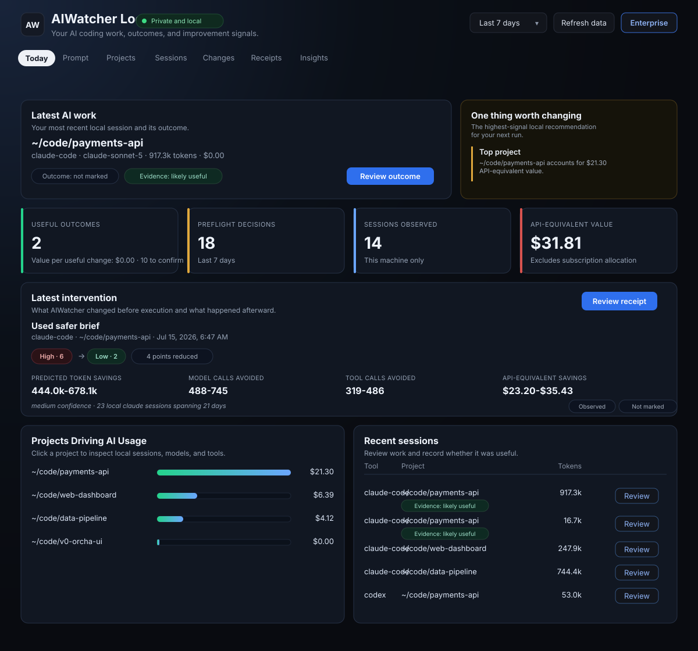

# AIWatcher Local

Know what your local AI coding tools are doing before the invoice, incident, or
runaway session surprises you.

AIWatcher Local gives developers private, zero-code-change visibility into
Claude Code, Codex CLI, Cursor, and other local AI coding activity. It reads the
history those tools already keep on your machine and turns it into an honest
view of usage, tokens, and API-equivalent cost — with no account, no upload, and
no changes to how you work.



## Privacy

- Local-only by default
- Read-only
- No LLM calls
- No prompt or source-code upload
- No cloud account required
- Works on macOS, Linux, and Windows

This trust boundary is the product. If AIWatcher Local cannot explain what it
reads and why, it should not read it.

## Quickstart

Clone and run directly — no install required (Python 3.9+):

```bash
git clone https://github.com/ai-watcher/aiwatcher-local.git
cd aiwatcher-local
```

From there, run any of the [commands](#commands) below. The local dashboard
(`ui`) serves on `http://127.0.0.1:8765`; if that port is busy, AIWatcher Local
automatically tries the next available port and prints the URL it picked.

### After PyPI release

```bash
pipx install aiwatcher-cli
aiwatcher today
aiwatcher ui
```

## Commands

Every command is read-only and runs against the history your tools already keep
locally. Run from a clone with `python -m aiwatcher_cli <command>`, or just
`aiwatcher <command>` once installed.

Cost is shown as **API-equivalent value** — AIWatcher Local separates API-priced
tokens from subscription/plan-limited tokens so you can read the numbers honestly.
Subscription plans may not bill this as incremental spend.

> The output below is real, captured from a live machine, with local paths
> replaced by `~/code/payments-api`.

### Detect your tools — `start`, `status`

```text
$ aiwatcher start
AIWatcher v0.1.0 - local mode
Read-only scan. No data leaves this machine.

Watching:
  ✓ Claude Code
  ✓ Cursor
  ✗ Codex CLI
  ✗ Cline
  ✗ Windsurf

Collected 2 sessions from the last 24 hours.
Run `aiwatcher today` to see your usage.
```

```text
$ aiwatcher status
AIWatcher Local status

✓ claude-code      8 sessions
✓ cursor           0 sessions
✗ codex-cli        0 sessions
✗ cline            0 sessions
✗ windsurf         0 sessions

Mode: local-only
Network: disabled unless hosted sync is configured separately
```

### Today's usage — `today`

```text
$ aiwatcher today
Today - Wednesday, June 24, 2026
2 sessions · 700.6k API-priced tokens · $16.01 API-equivalent value
Projected month: ~$97.34 API-equivalent at current pace
Note: subscription plans may not bill this as incremental spend.

By tool
Tool              API value   Calls    Tokens Sessions
--------------------------------------------------------
claude-code          $16.01     340    700.6k        2

By model
Model                         API value    Tokens   Calls
----------------------------------------------------------
claude-opus-4-8                  $16.01    700.6k     340

Top project: ~/code/payments-api (100% of today's API-equivalent value)

This week: $17.21
This month: $77.87
```

### Rank usage — `tools`, `projects`

```text
$ aiwatcher tools --days 7
AI usage by tool - last 7 days
Cost is shown as API-equivalent value; subscription plans may differ.

claude-code        4 sessions    120.4k in    664.2k out      $17.21
```

```text
$ aiwatcher projects --days 7
AI usage by project - last 7 days
Cost is shown as API-equivalent value; subscription plans may differ.

    $17.21     4 sessions    784.7k tokens  ~/code/payments-api
```

### Weekly report — `report`

```text
$ aiwatcher report --days 7
AIWatcher Local report - last 7 days

Sessions: 4
API-equivalent value: $17.21
Tokens: 784.7k
Model calls: 381
Tool calls: 180

Top project: ~/code/payments-api ($17.21)
Top tool: claude-code (4 sessions)
Top model: claude-opus-4-8 (784.7k tokens)
```

### Recent sessions — `sessions`

```text
$ aiwatcher sessions --days 1
Recent AI sessions - last 1 days

Jun 24 22:14 claude-code      $15.80   674.5k tokens  ~/code/payments-api
Jun 24 07:08 claude-code       $0.21    26.1k tokens  ~/code/payments-api
```

### Export your data — `export`

Session summaries as JSON:

```text
$ aiwatcher export --format json --days 30
{
  "schema": "aiwatcher.local_sessions.v0",
  "sessions": [
    {
      "session_id": "9f2c7e1a-3b4d-4e6f-8a0b-1c2d3e4f5a6b",
      "tool": "claude-code",
      "project_path": "~/code/payments-api",
      "started_at": "2026-06-24T14:15:48+00:00",
      "updated_at": "2026-06-25T05:15:15+00:00",
      "model": "claude-opus-4-8",
      "tokens_in": 53317,
      "tokens_out": 622187,
      "cost_usd": 15.82126,
      "agent_calls": 331,
      "tool_calls": 159,
      "notes": []
    }
  ]
}
```

Privacy-safe event hashes — `content_hash` only, never prompt or source text:

```text
$ aiwatcher export --format json --level events --days 7
{
  "schema": "aiwatcher.local_events.v0",
  "events": [
    {
      "event_id": "843b28a20f07ecf1279bf6a7",
      "session_id": "9f2c7e1a-3b4d-4e6f-8a0b-1c2d3e4f5a6b",
      "tool": "claude-code",
      "event_type": "queue-operation",
      "timestamp": "2026-06-24T14:15:48+00:00",
      "project_path": "~/code/payments-api",
      "model": null,
      "tokens_in": 0,
      "tokens_out": 0,
      "cost_usd": 0.0,
      "content_hash": null,
      "notes": []
    }
  ]
}
```

### Browser dashboard — `ui`

```text
$ aiwatcher ui
```

Opens a local-only dashboard at `http://127.0.0.1:8765` (it auto-picks the next
free port if that one is busy). It's the clickable version of everything above —
see the screenshot at the top of this README.

## What it reads

- **Claude Code** — `~/.claude/projects/**/*.jsonl`, normalized to the git
  project root when possible.
- **Codex CLI** — local SQLite history in read-only mode when available.
- **Cursor / Cline / Windsurf** — detected where local history is exposed; token
  and cost detail are intentionally marked limited when a vendor does not store
  it locally.

Tool coverage depends on what each vendor stores on your machine. When a tool is
installed but token/cost history is not exposed, AIWatcher Local says so instead
of guessing.

See [docs/AIWATCHER_LOCAL.md](docs/AIWATCHER_LOCAL.md) for the full product
boundary, privacy contract, and validation checklist.

## AIWatcher Local vs AIWatcher Enterprise

AIWatcher Local is the open-source, local-only visibility tool for individual
developers. It is meant to be genuinely useful on its own.

AIWatcher Enterprise adds what teams need: shared dashboards, hosted retention,
budget guardrails, anomaly alerts, HITL approvals, audit evidence, SSO/RBAC, and
production app governance. Learn more at <https://www.getaiwatcher.com>.

Enterprise features are additive. AIWatcher Local is never gated behind signup.

## Contributing

Contributions are welcome — see [CONTRIBUTING.md](CONTRIBUTING.md) and our
[Code of Conduct](CODE_OF_CONDUCT.md). To report a security issue, see
[SECURITY.md](SECURITY.md).

## License

[MIT](LICENSE)
