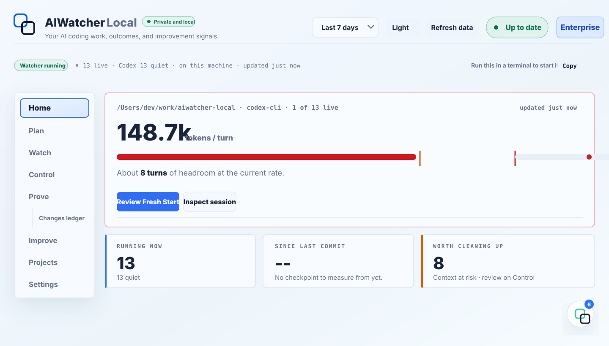
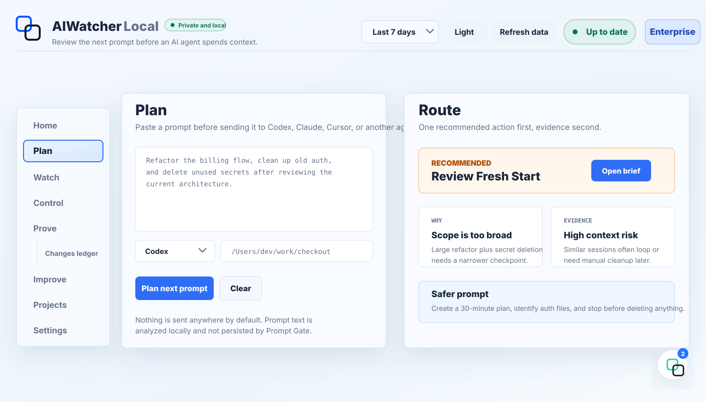

# AIWatcher Local

[](https://github.com/ai-watcher/aiwatcher-local/actions/workflows/ci.yml)
[](https://pypi.org/project/aiwatcher-local/)
[](LICENSE)

Private guardrails for AI coding work. AIWatcher helps you review risky
prompts before they run, notice expensive or stuck sessions while they are
active, and prove whether the work became useful code afterwards.

It works with local history from tools such as Claude Code, Codex, and Cursor.
No account is required. No cloud upload happens by default. No LLM call happens
unless you explicitly configure optional AI Assist.



## Contents

- [What You Get](#what-you-get)
- [First Look](#first-look)
- [Why Developers Use It](#why-developers-use-it)
- [Quick Start](#quick-start)
- [Choose an Install Method](#choose-an-install-method)
- [Install pipx](#install-pipx)
- [Upgrade or Reinstall](#upgrade-or-reinstall)
- [Troubleshooting](#troubleshooting)
- [First Useful Checks](#first-useful-checks)
- [Optional Hooks](#optional-hooks)
- [Clone The Codebase](#clone-the-codebase)
- [What It Reads](#what-it-reads)
- [Common Commands](#common-commands)
- [Project Status](#project-status)
- [AIWatcher Local and Enterprise](#aiwatcher-local-and-enterprise)
- [Contributing](#contributing)
- [License](#license)

## What You Get

In the first few minutes, AIWatcher gives one developer a local control loop for
AI coding work:

- **Before the run:** review risky or over-broad prompts before an agent spends
  context.
- **During the run:** notice loops, context pressure, idle sessions, and work
  waiting on you.
- **After the run:** connect AI sessions to commits, outcomes, receipts, and
  improvement signals.

No signup is required, and the default install keeps data on your machine.

## First Look

The Home view shows active AI work, context pressure, update status, and the
small Companion control. Plan helps narrow risky prompts before an agent spends
context:



## Why Developers Use It

- **Catch expensive prompts early:** preflight broad, vague, destructive, or
  high-context work before an AI agent starts spending tokens.
- **Stay out of runaway sessions:** get local nudges for context pressure,
  loops, long-running work, and sessions waiting on you.
- **Start fresh without losing the plot:** create a compact Fresh Start brief
  for continuing work in a new session.
- **Prove what was worth it:** connect local AI sessions to commits, outcomes,
  receipts, and API-equivalent usage.
- **Keep trust visible:** label what is automatic, what is inferred, and what
  the current tool surface cannot prove.

## Quick Start

For most users, the best path is [`pipx`](https://pipx.pypa.io/latest/).
It installs AIWatcher from
[PyPI](https://pypi.org/project/aiwatcher-local/) in an isolated environment
and makes the `aiwatcher` command available everywhere.

You need Python 3.10 or newer for current versions of `pipx`. If `pipx` is
already installed:

```console
pipx install aiwatcher-local
pipx ensurepath
```

Open a new terminal after `ensurepath`, then start AIWatcher:

```console
aiwatcher setup
aiwatcher doctor
aiwatcher start --open-ui
```

That is the complete normal installation. `setup` detects supported local AI
tools and prints relevant next steps; it is not an interactive menu.
`start --open-ui` starts the private local Console and Companion, then opens the
Console in your browser.

If `pipx install` says `aiwatcher-local` is already installed, that is expected.
Do not use `--force` for a routine update. Run:

```console
pipx upgrade aiwatcher-local
```

## Choose an Install Method

Use the first method that fits your situation:

| Preference | Method | Best for |
| --- | --- | --- |
| **1. Recommended** | `pipx install aiwatcher-local` | Almost everyone; isolated, available from any terminal, and easy to upgrade |
| **2. Existing Python environment** | `python -m pip install aiwatcher-local` | Users who deliberately manage and activate their own virtual environment |
| **3. Source clone** | `git clone ...` and editable install | Contributors and users who need unreleased `main` changes |

Do not clone the repository just to use AIWatcher. Do not install it into the
macOS, Homebrew, or Linux system Python, and do not use
`--break-system-packages`.

## Install pipx

Skip this section if `pipx --version` already works. These commands follow the
official [pipx installation guide](https://pipx.pypa.io/latest/how-to/install-pipx.html).

### macOS

```console
brew install pipx
pipx ensurepath
```

If `brew` is unavailable, install it from [brew.sh](https://brew.sh/) or use the
virtual-environment method below.

### Ubuntu or Debian

Ubuntu 23.04+, Debian 12+, and newer releases:

```console
sudo apt update
sudo apt install pipx
pipx ensurepath
```

Older distributions may not package `pipx`. Follow the official pipx guide for
your distribution instead of modifying an externally managed system Python.

### Fedora

```console
sudo dnf install pipx
pipx ensurepath
```

### Windows PowerShell

With Python from python.org:

```powershell
py -m pip install --user pipx
py -m pipx ensurepath
```

Open a new PowerShell window, then use `pipx install aiwatcher-local`. If the
`pipx` command is still unavailable, use `py -m pipx` in its place:

```powershell
py -m pipx install aiwatcher-local
py -m pipx upgrade aiwatcher-local
```

Windows Subsystem for Linux users should follow the Linux instructions inside
their WSL distribution, not mix Windows and WSL Python installations.

### Install with pip in a virtual environment

AIWatcher itself supports Python 3.9+, although Python 3.10+ is recommended.
Use this path when you intentionally prefer `pip` or cannot install `pipx`.

macOS or Linux:

```console
python3 -m venv ~/.venvs/aiwatcher-local
source ~/.venvs/aiwatcher-local/bin/activate
python -m pip install --upgrade aiwatcher-local
aiwatcher setup
aiwatcher doctor
aiwatcher start --open-ui
```

Windows PowerShell:

```powershell
py -m venv "$HOME\.venvs\aiwatcher-local"
& "$HOME\.venvs\aiwatcher-local\Scripts\Activate.ps1"
python -m pip install --upgrade aiwatcher-local
aiwatcher setup
aiwatcher doctor
aiwatcher start --open-ui
```

Activate this environment again before running `aiwatcher` in a new terminal.
This activation requirement is why `pipx` is the default recommendation.

## Upgrade or Reinstall

Use the update command belonging to the method that installed AIWatcher:

| Installation | Normal update |
| --- | --- |
| `pipx` from PyPI | `pipx upgrade aiwatcher-local` |
| Windows using `py -m pipx` | `py -m pipx upgrade aiwatcher-local` |
| `pip` virtual environment | Activate the environment, then run `python -m pip install --upgrade aiwatcher-local` |
| `uv tool` | `uv tool upgrade aiwatcher-local` |
| Source clone on `main` | `aiwatcher update --apply`, then `aiwatcher start --open-ui` |

The Console update indicator uses the same distinction. PyPI installs compare
their installed version with the latest PyPI release. Source clones compare
their checkout with `origin/main`. Clicking the indicator reviews the update;
applying and restarting is a separate explicit action.

Merging a change into GitHub `main` does **not** update PyPI installations. A
maintainer must publish a newer version first. If PyPI still has the same
version, `pipx upgrade` correctly reports that nothing changed.

Use a reinstall only when the environment is broken or you need to change its
Python interpreter:

```console
pipx reinstall aiwatcher-local
```

To remove AIWatcher completely:

```console
pipx uninstall aiwatcher-local
```

Users of the original `aiwatcher-cli` 0.1.0 package should migrate once:

```console
pipx uninstall aiwatcher-cli
pipx install aiwatcher-local
```

## Troubleshooting

Start with the first command that fails, then use the matching row.

| Error or symptom | Fix |
| --- | --- |
| `pipx: command not found` | Install `pipx` using the platform section above, run `pipx ensurepath`, and open a new terminal. On Windows, try `py -m pipx`. |
| `aiwatcher: command not found` | Run `pipx ensurepath`, open a new terminal, and confirm `pipx list` includes `aiwatcher-local`. |
| `aiwatcher-local ... already seems to be installed` | This is normal. Use `pipx upgrade aiwatcher-local`; use `pipx reinstall` only to repair the environment. |
| `No matching distribution found for aiwatcher-local` | Check spelling, internet/index configuration, and `python --version`. AIWatcher requires Python 3.9+; current `pipx` requires Python 3.10+. |
| `externally-managed-environment` | Stop using system `pip`. Install with `pipx` or create the virtual environment shown above. Do not add `--break-system-packages`. |
| `No module named pipx` | Install `pipx` first. On Linux with PEP 668, use `apt`, `dnf`, or the official pipx guide rather than system `pip`. |
| `No module named pip3` | Use `python3 -m pip`, not `python3 -m pip3`; the module name is `pip`. |
| `python3` or `py` is missing | Install Python 3.10+ from your platform package manager or [python.org](https://www.python.org/downloads/), then open a new terminal. |
| Dashboard opens an older checkout | Stop the old process and run `aiwatcher start --open-ui` from the intended installation. `aiwatcher doctor` reports integration and install details. |
| Upgrade reports no change | Check the installed and available versions with `pipx list` and the [PyPI release page](https://pypi.org/project/aiwatcher-local/). GitHub `main` may be newer than the latest published package. |

## First Useful Checks

```sh
aiwatcher doctor
aiwatcher hook-status
aiwatcher preflight "Refactor the checkout flow and delete old auth secrets" --tool codex --cwd "$(pwd)"
```

- `doctor` shows which local tools AIWatcher can read.
- `hook-status` proves whether a tool actually invoked AIWatcher.
- `preflight` gives value immediately, even before hooks are installed.

## Optional Hooks

Hooks let AIWatcher act before the AI tool spends context. Install only the
ones you use:

```sh
aiwatcher install-claude-hook --write --scope user --gate
aiwatcher install-codex-hook --write --scope user --gate
aiwatcher install-cursor-hook --write --scope user --gate
```

For Claude Code CLI, AIWatcher can also review risky shell commands before
they run:

```sh
aiwatcher install-claude-command-gate --write --scope user
```

Then send a small test prompt in your AI tool and verify:

```sh
aiwatcher hook-status
```

If a surface does not invoke hooks, use the Console or Companion **Plan** flow
to preflight prompts manually. AIWatcher does not claim silent protection on
tool surfaces that do not expose a verified lifecycle hook.

## Clone The Codebase

Clone only if you want to contribute, inspect code locally, or use the
dashboard's source-update flow. Most users should use the `pipx` path above.

The source clone path creates a project-local virtual environment, so it does
not modify your Homebrew, system, or Windows Python packages.

macOS or Linux:

```sh
git clone https://github.com/ai-watcher/aiwatcher-local.git
cd aiwatcher-local
python3 -m venv .venv
source .venv/bin/activate
python -m pip install -e .
python -m aiwatcher_cli setup
python -m aiwatcher_cli start --open-ui
```

Windows PowerShell:

```powershell
git clone https://github.com/ai-watcher/aiwatcher-local.git
cd aiwatcher-local
py -m venv .venv
.\.venv\Scripts\Activate.ps1
python -m pip install -e .
python -m aiwatcher_cli setup
python -m aiwatcher_cli start --open-ui
```

The key detail is `python -m pip` inside the virtual environment. Do not use
`python -m pip3`.

On a clean `main` checkout, `aiwatcher update --apply` fetches and fast-forwards
the clone. On a feature branch or a checkout with local changes, use your normal
Git workflow; AIWatcher refuses to overwrite or move that work automatically.

## What It Reads

AIWatcher reads local evidence that AI tools already store on your machine.

| Area | What AIWatcher uses |
| --- | --- |
| Claude Code | Local JSONL session history under `~/.claude` when present |
| Codex | Local rollout/session history when available |
| Cursor and other tools | Detected local history where the tool exposes it |
| Git repositories | Commit metadata, diffs, kept-line checks, and local working tree state |
| Runtime watch | Process metadata such as age, CPU/RAM, command, and known session flags |

AIWatcher stores local receipts, hashes, decisions, outcomes, and metadata. It
does not persist raw prompt text from Prompt Gate decisions. Optional AI Assist
can send bounded prompt/source context only when you configure it and choose a
workflow that uses it.

See [docs/AIWATCHER_LOCAL.md](docs/AIWATCHER_LOCAL.md) for the full privacy and
coverage boundary.

## Laptop Footprint

AIWatcher is a Python package with static dashboard assets, not a native
background daemon. It does nothing in the background until you run
`aiwatcher start`, `aiwatcher companion start`, or install login autostart.

Measured from this repo on macOS with Python 3.14:

| Area | Observed footprint |
| --- | --- |
| Wheel artifact | 530 KB |
| Installed AIWatcher package | 3.9 MB, excluding the Python/pipx environment |
| Python dependencies | None declared by AIWatcher |
| Idle dashboard process | Usually tens of MB RSS, near 0% CPU when idle |
| Dashboard + Companion | Near 0% CPU between scans; short scan spikes depend on local history size |

On the measured machine, a Companion startup scan over recent local AI history
briefly used more CPU and memory, then settled back near idle. Larger local
Claude/Codex/Cursor histories can make that scan peak higher. The default
Companion interval is 30 seconds, and you can stop it any time:

```sh
aiwatcher companion stop
```

## Common Commands

| Command | Purpose |
| --- | --- |
| `aiwatcher setup` | Detect tools and show recommended setup |
| `aiwatcher start --open-ui` | Start the Console and Companion |
| `aiwatcher doctor` | Check local detection and integration health |
| `aiwatcher hook-status` | Verify hook invocation |
| `aiwatcher preflight "..."` | Review a prompt manually |
| `aiwatcher sessions` | Review recent local AI sessions |
| `aiwatcher changes --days 30` | See AI-attributed commit evidence |
| `aiwatcher outcome useful` | Mark the latest session outcome |
| `aiwatcher update` | Check the running source or package installation for updates |

Full command reference: [docs/CLI.md](docs/CLI.md).

## Project Status

AIWatcher Local is an early open-source release. The local-first workflow is
usable today, but hook coverage depends on what each AI tool exposes on your
machine. The UI is moving quickly, so screenshots and docs may change while the
core privacy boundary stays stable.

Useful next reads:

- [Product and validation notes](docs/AIWATCHER_LOCAL.md)
- [CLI reference](docs/CLI.md)
- [HTTP API reference](docs/HTTP-API.md)
- [Release checklist](docs/RELEASE.md)

## AIWatcher Local and Enterprise

AIWatcher Local is the open-source, developer-controlled loop for one machine.
It should be useful without signup, a cloud account, or a team admin.

AIWatcher Enterprise adds team policy, budgets, approvals, audit evidence,
SSO/RBAC, managed deployment, central retention, org dashboards, and
production-agent governance. Enterprise features are additive; Local is not a
locked demo.

The Apache-2.0 license covers this code. It does not grant rights to the
AIWatcher name, logo, hosted service, or Enterprise control plane. Learn more at
<https://www.getaiwatcher.com>.

## Contributing

Contributions are welcome. Start with [CONTRIBUTING.md](CONTRIBUTING.md).

For security reports, use [SECURITY.md](SECURITY.md). Please follow the
[Code of Conduct](CODE_OF_CONDUCT.md).

## License

[Apache License 2.0](LICENSE)
